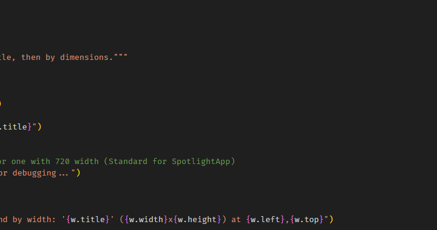

# ⬡ IntelliDesk AI

**AI-Powered Desktop Automation Assistant**

Control your Windows PC using natural language commands in **English or Hinglish**. Built with **Python** and powered by **Groq AI**.


---

# 🎯 Overview

IntelliDesk AI is a **desktop automation assistant** that understands natural language and executes tasks on your behalf.

It combines **AI intelligence + a beautiful glassmorphic UI** to create a **Raycast-like experience for Windows**.

### Key Features

* 🤖 Natural language understanding (English + Hinglish)
* 🎙️ Voice commands via speech recognition
* ⚡ 65+ built-in automation functions
* 🎨 Premium glassmorphic UI with blur effects
* 🛡️ Sentry mode with motion detection
* 💬 Multi-step command chaining

---

# 📸 Screenshots

### Command Palette UI


### Voice Command in Action


### Automation Example



### Sentry Mode


---

# ✨ What Can It Do?

## 🖥 System Control

```bash
open chrome
take a screenshot
lock the system
shutdown computer
volume up
brightness down
```

---

## 📁 File Management

```bash
create file notes.txt
delete folder temp
search files in documents
organize downloads
```

---

## 🌐 Web & Search

```bash
google search python tutorials
play music on youtube
open wikipedia
weather forecast
```

---

## 💬 Communication

```bash
send whatsapp to john saying hello
email mom with subject birthday
save contact john 9876543210
```

---

## ⚡ Productivity

```bash
set timer for 5 minutes
remind me in 10 minutes
calculate 15 percent of 200
what time is it
```

---

## 🇮🇳 Hinglish Commands

```bash
chrome kholo
screenshot le lo
john ko whatsapp bhejo
volume badhao
time kya hai
```

---

## 🔗 Multi-Step Automation

```bash
open chrome then search python tutorials
volume up then take screenshot
create file notes.txt then open notepad
```

---

# 🚀 Installation

## Prerequisites

* Python **3.11+**
* Windows **10 / 11**
* Internet connection (for AI features)

---

## 1️⃣ Clone the Repository

```bash
git clone https://github.com/yourusername/IntelliDesk-AI.git
cd IntelliDesk-AI
```

---

## 2️⃣ Install Dependencies

```bash
pip install -r requirements.txt
```

---

## 3️⃣ Configure Environment

Create a `.env` file in the root directory:

```env
GROQ_API_KEY=your_groq_api_key_here
```

Get your free API key from **Groq Console**.

---

## 4️⃣ Run the Application

```bash
python run.py
```

Press **Ctrl + Space** to open the command palette.

---

# ⌨️ Keyboard Shortcuts

| Shortcut     | Action                       |
| ------------ | ---------------------------- |
| Ctrl + Space | Open / Close command palette |
| Enter        | Execute command              |
| F10          | Stop voice output            |
| F11          | Toggle microphone            |
| F12          | Toggle voice output          |
| Esc          | Close palette                |

---

# 🎨 Features in Detail

## 🤖 AI-Powered Understanding

Uses **Groq's LLM** to:

* Understand natural language commands
* Detect user intent
* Execute automation functions

---

## 🎙 Voice Control

* Speech-to-Text (Speak commands)
* Text-to-Speech responses
* Continuous listening mode

---

## 🎨 Glassmorphic UI

Modern command palette with:

* Acrylic blur effects
* Smooth animations
* System tray integration
* Always-on-top floating window

---

## 🛡️ Sentry Mode

Motion detection surveillance using your webcam.

Features:

* Detects movement
* Sends Telegram alerts with photos
* Auto breaks to prevent overheating
* Configurable duration

---

## 🌍 Multi-Language Support

Mix English and Hindi seamlessly.

```bash
chrome kholo then google pe AI search karo
screenshot le lo then john ko whatsapp bhejo
```

---

# 📁 Project Structure

```
IntelliDesk-AI/
├── run.py
├── config.py
├── requirements.txt
├── .env

├── src/
│   ├── automation/
│   │   ├── system_ops.py
│   │   ├── whatsapp.py
│   │   ├── email_ops.py
│   │   └── sentry_mode.py
│
│   ├── core/
│   │   ├── conversation_manager.py
│   │   ├── groq_assistant.py
│   │   └── function_registry.py
│
│   ├── gui/
│   │   └── spotlight_app.py
│
│   ├── llm/
│   │   ├── groq_client.py
│   │   └── ollama_client.py
│
│   └── utils/
│       ├── voice_manager.py
│       └── stt_manager.py
│
└── data/
    ├── intellidesk.db
    └── logs/
```

---

# 🛠 Advanced Configuration

### Environment Variables

| Variable           | Description      | Default  |
| ------------------ | ---------------- | -------- |
| GROQ_API_KEY       | Groq API key     | required |
| TELEGRAM_BOT_TOKEN | Telegram alerts  | optional |
| TELEGRAM_CHAT_ID   | Telegram chat ID | optional |
| VOICE_ENABLED      | Enable voice     | true     |
| VOICE_RATE         | Speech speed     | 150      |

---

# 💻 CLI Mode

You can run IntelliDesk in terminal mode:

```bash
python run.py --cli
```

---

# 🤝 Contributing

1. Fork the repository
2. Create a branch

```
git checkout -b feature/AmazingFeature
```

3. Commit changes

```
git commit -m "Add AmazingFeature"
```

4. Push

```
git push origin feature/AmazingFeature
```

5. Open Pull Request

---

# 📝 License

This project is licensed under the **MIT License**.

---

# 🙏 Acknowledgments

* Groq – Fast AI inference
* Ollama – Local AI models
* Edge TTS – Natural voice synthesis
* CustomTkinter – Modern Python UI

---

# 📧 Contact

For questions or suggestions:

**GitHub:** abhaygupta56
**Email:** [abhaygupta3347@gmail.com]

---

<div align="center">

⭐ **Star this repo if you find it useful!**

Made with ❤️ and Python

</div>
