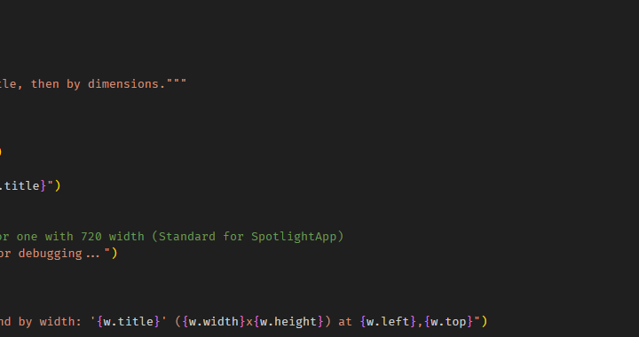

<div align="center">


# IntelliDesk AI

**AI-powered desktop automation — controlled by natural language.**

Control your Windows PC with English or Hinglish commands, chain multi-step workflows,  
and monitor your space, all from a single glassmorphic command palette.

[](https://www.python.org/)
[](https://www.microsoft.com/windows)
[](https://groq.com)
[](LICENSE)

[Quick Start](#-quick-start) · [Features](#-features) · [Commands](#-commands) · [Configuration](#-configuration) · [Project Structure](#-project-structure)

</div>

---

## What is IntelliDesk AI?

IntelliDesk AI turns your Windows desktop into a voice- and text-driven workspace. Open apps, manage files, send WhatsApp messages, generate code, set timers, and watch over your room — all without touching another menu or shortcut.

Press **Ctrl+Space** to summon the command palette. Type or speak. Done.

> Built for people who prefer talking to their PC over clicking through it.

---

## 📸 Preview

| Command Palette | Multi-Step Automation | Code Generation |
|:-:|:-:|:-:|
|  |  |  |
| Glassmorphic spotlight UI | Chain commands seamlessly | AI writes code via Ollama |

---

## ✨ Features

### 🤖 AI & Language
- **Groq LLM** for sub-second intent detection via function calling
- **Hinglish support** — mix Hindi and English naturally
- **Conversation memory** — context carries across commands
- **Ollama integration** — generate code locally, no API needed

### 🎙️ Voice
- Google Speech-to-Text + Edge TTS for natural voice I/O
- Continuous hands-free listening with auto-stop on silence
- English and Hindi both supported

### 🖥️ Desktop Automation — 65+ functions
- Open/close apps, manage windows, control volume & brightness
- File operations: create, delete, rename, copy, move, organize
- Keyboard shortcuts, media controls, system lock/sleep/shutdown

### 💬 Messaging & Email
- **WhatsApp** — send messages, share files, schedule messages, manage contacts
- **Email** — compose and send with subject support, saved contact book

### 🛡️ Sentry Mode
- Webcam motion detection with Telegram photo alerts
- Auto-breaks every 20 minutes, max 2-hour runtime
- Photos auto-delete after sending

### 🎨 UI & Performance
- Glassmorphic command palette (Raycast-inspired, dark theme)
- System tray background operation
- Lightweight, thread-safe, with graceful error recovery

---

## 🚀 Quick Start

### Prerequisites

- Python **3.11+**
- Windows **10 or 11** (64-bit)
- Microphone *(for voice commands)*
- Webcam *(for Sentry mode only)*

### 1 — Clone

```bash
git clone https://github.com/abhaygupta56/IntelliDesk-AI.git
cd IntelliDesk-AI
```

### 2 — Install dependencies

```bash
pip install -r requirements.txt
```

### 3 — Configure environment

Create a `.env` file in the project root:

```env
# Required
GROQ_API_KEY=your_groq_api_key_here          # → console.groq.com

# Optional — Sentry Mode alerts
TELEGRAM_BOT_TOKEN=your_bot_token_here       # → @BotFather on Telegram
TELEGRAM_CHAT_ID=your_chat_id_here           # → @userinfobot on Telegram

# Optional — Local code generation
OLLAMA_BASE_URL=http://localhost:11434
OLLAMA_MODEL=qwen2.5-coder:3b
```

### 4 — Launch

```bash
python run.py
```

> **First time?** Press `Ctrl+Space` to open the command palette.  
> Prefer the terminal? Run `python run.py --cli` for a CLI-only mode.

---

## ⌨️ Hotkeys

| Hotkey | Action |
|:--|:--|
| `Ctrl+Space` | Open / close command palette |
| `Enter` | Execute command |
| `F10` | Stop voice output |
| `F11` | Toggle microphone |
| `F12` | Toggle text-to-speech |
| `Esc` | Hide palette |

---

## 💬 Commands

Every command has an English and Hinglish variant. Examples below.

<details>
<summary><strong>🖥️ System Control</strong></summary>

| English | Hinglish |
|:--|:--|
| `open chrome` | `chrome kholo` |
| `close notepad` | `notepad band karo` |
| `lock the system` | `system lock karo` |
| `shutdown computer` | `computer band kar do` |
| `restart pc` | `restart kar do` |
| `volume up / down` | `volume badhao / kam karo` |
| `brightness up / down` | `brightness badhao / kam karo` |
| `mute / unmute volume` | `mute kar do / unmute karo` |
| `system info` | `system info batao` |

</details>

<details>
<summary><strong>📁 File Management</strong></summary>

| English | Hinglish |
|:--|:--|
| `create file notes.txt` | `file banao notes.txt` |
| `create folder documents` | `folder banao documents` |
| `delete file test.txt` | `file delete karo test.txt` |
| `search files in documents` | `documents mein files search karo` |
| `organize downloads` | `downloads organize karo` |
| `rename file old.txt to new.txt` | `file ka naam badlo old.txt se new.txt` |
| `copy file to desktop` | `file copy karo desktop pe` |
| `open file explorer` | `file explorer kholo` |

</details>

<details>
<summary><strong>🌐 Web & Search</strong></summary>

| English | Hinglish |
|:--|:--|
| `google search python tutorials` | `google pe python search karo` |
| `youtube search coding` | `youtube pe coding search karo` |
| `play python tutorial on youtube` | `python tutorial play karo youtube pe` |
| `open wikipedia` | `wikipedia kholo` |
| `weather forecast` | `mausam kya hai` |
| `open website github.com` | `website kholo github.com` |

</details>

<details>
<summary><strong>💬 WhatsApp</strong></summary>

| English | Hinglish |
|:--|:--|
| `send whatsapp to john saying hello` | `john ko whatsapp bhejo hello bol do` |
| `save whatsapp contact john 9876543210` | `john ka number save karo 9876543210` |
| `send file to john on whatsapp` | `john ko file bhejo whatsapp pe` |
| `schedule whatsapp to john at 5 PM` | `john ko 5 baje whatsapp schedule karo` |
| `list whatsapp contacts` | `whatsapp contacts dikhao` |

> Auto-detects saved contacts. Prompts for a phone number if the contact isn't found.

</details>

<details>
<summary><strong>📧 Email</strong></summary>

| English | Hinglish |
|:--|:--|
| `send email to john` | `john ko email bhejo` |
| `email mom with subject birthday` | `mummy ko email karo birthday subject se` |
| `save email contact john john@email.com` | `john ka email save karo` |
| `list email contacts` | `email contacts dikhao` |

</details>

<details>
<summary><strong>⌨️ Keyboard & Windows</strong></summary>

| English | Hinglish |
|:--|:--|
| `type hello world` | `hello world type karo` |
| `press enter / escape / f5` | `enter / escape / f5 dabao` |
| `copy / paste / cut` | `copy / paste / cut karo` |
| `undo / redo` | `undo / redo karo` |
| `minimize / maximize window` | `window minimize / maximize karo` |
| `close notepad` | `notepad band karo` |
| `switch to chrome` | `chrome pe switch karo` |
| `list all windows` | `sare windows dikhao` |

</details>

<details>
<summary><strong>📸 Screenshots & Media</strong></summary>

| English | Hinglish |
|:--|:--|
| `take a screenshot` | `screenshot le lo` |
| `play / pause music` | `music chala / roko` |
| `next / previous song` | `agla / pichla gaana` |
| `stop music` | `music band karo` |

</details>

<details>
<summary><strong>⏰ Timers & Reminders</strong></summary>

| English | Hinglish |
|:--|:--|
| `set timer for 5 minutes` | `5 minute ka timer lagao` |
| `stop timer` | `timer band karo` |
| `remind me in 10 minutes` | `10 minute baad yaad dilao` |
| `remind me at 5 PM` | `5 baje yaad dilao` |
| `show my reminders` | `mere reminders dikhao` |

</details>

<details>
<summary><strong>🧮 Utilities</strong></summary>

| English | Hinglish |
|:--|:--|
| `what time is it` | `time kya hai` |
| `calculate 15 percent of 200` | `200 ka 15 percent calculate karo` |
| `flip a coin` | `coin flip karo` |
| `roll a dice` | `dice roll karo` |

</details>

<details>
<summary><strong>💻 Code Generation</strong></summary>

| English | Hinglish |
|:--|:--|
| `write python code for bubble sort` | `python code likh bubble sort ka` |
| `generate code to reverse a string` | `string reverse karne ka code banao` |
| `write javascript code for calculator` | `javascript mein calculator ka code likh` |

> Automatically detects language. Saves output to `generated_codes/`.  
> Supported: Python, JavaScript, Java, C++, C#, HTML, CSS.

</details>

<details>
<summary><strong>🛡️ Sentry Mode</strong></summary>

| English | Hinglish |
|:--|:--|
| `start sentry for 30 minutes` | `30 minute ke liye sentry chalu karo` |
| `activate sentry mode` | `sentry mode activate karo` |
| `sentry status` | `sentry ka status batao` |
| `stop sentry` | `sentry band karo` |

> Webcam-based motion detection · Telegram alerts · Auto-break every 20 min · Photos auto-delete.

</details>

<details>
<summary><strong>🔗 Multi-Step Automation</strong></summary>

Chain any commands with `then`:

```bash
# English
open chrome then search python tutorials
volume up then take screenshot then lock system

# Hinglish
chrome kholo then google pe AI search karo
screenshot le lo then john ko whatsapp bhejo

# Mixed
open chrome then youtube pe python search karo
volume badhao then screenshot le lo then system lock karo
```

</details>

---

## ⚙️ Configuration

| Variable | Description | Required |
|:--|:--|:--|
| `GROQ_API_KEY` | Groq API key for LLM | ✅ Yes |
| `TELEGRAM_BOT_TOKEN` | Telegram bot token for Sentry alerts | Optional |
| `TELEGRAM_CHAT_ID` | Your Telegram chat ID | Optional |
| `OLLAMA_BASE_URL` | Ollama server URL (default: `http://localhost:11434`) | Optional |
| `OLLAMA_MODEL` | Model for code generation (default: `qwen2.5-coder:3b`) | Optional |
| `VOICE_ENABLED` | Enable TTS by default (default: `true`) | Optional |
| `VOICE_RATE` | Speech rate 100–200 (default: `150`) | Optional |
| `VOICE_GENDER` | Voice gender — `male` / `female` | Optional |

---

## 📂 Project Structure

```
IntelliDesk-AI/
├── run.py                      # Entry point
├── config.py                   # Configuration loader
├── requirements.txt
├── .env                        # Your API keys (not committed)
│
├── src/
│   ├── automation/             # 65+ automation functions
│   │   ├── system_ops.py
│   │   ├── file_ops.py
│   │   ├── web_ops.py
│   │   ├── whatsapp.py
│   │   ├── email_ops.py
│   │   ├── keyboard_ops.py
│   │   ├── window_ops.py
│   │   ├── media_ops.py
│   │   ├── reminder_ops.py
│   │   ├── utility_ops.py
│   │   └── sentry_mode.py
│   │
│   ├── core/                   # Orchestration layer
│   │   ├── conversation_manager.py
│   │   ├── groq_assistant.py
│   │   └── function_registry.py
│   │
│   ├── gui/
│   │   └── spotlight_app.py    # Glassmorphic command palette
│   │
│   ├── llm/
│   │   ├── groq_client.py
│   │   └── ollama_client.py
│   │
│   ├── database/
│   │   └── db_manager.py       # SQLite persistence
│   │
│   └── utils/
│       ├── voice_manager.py    # TTS
│       ├── stt_manager.py      # Speech-to-Text
│       ├── telegram_notifier.py
│       └── logger.py
│
└── data/
    ├── intellidesk.db
    └── logs/
```

---

## 🤝 Contributing

Contributions, issues, and feature requests are welcome.  
Please read [CONTRIBUTING.md](CONTRIBUTING.md) before submitting a pull request.

---

## 📄 License

Released under the [MIT License](LICENSE).

---

## 🙏 Acknowledgements

[Groq](https://groq.com) · [Ollama](https://ollama.com) · [Edge TTS](https://github.com/rany2/edge-tts) · [CustomTkinter](https://github.com/TomSchimansky/CustomTkinter) · [OpenCV](https://opencv.org)

---

<div align="center">

Made with Python by [Abhay Gupta](https://github.com/abhaygupta56)  
[abhaygupta3347@gmail.com](mailto:abhaygupta3347@gmail.com)

⭐ Star this repo if IntelliDesk saves you time!

</div>
