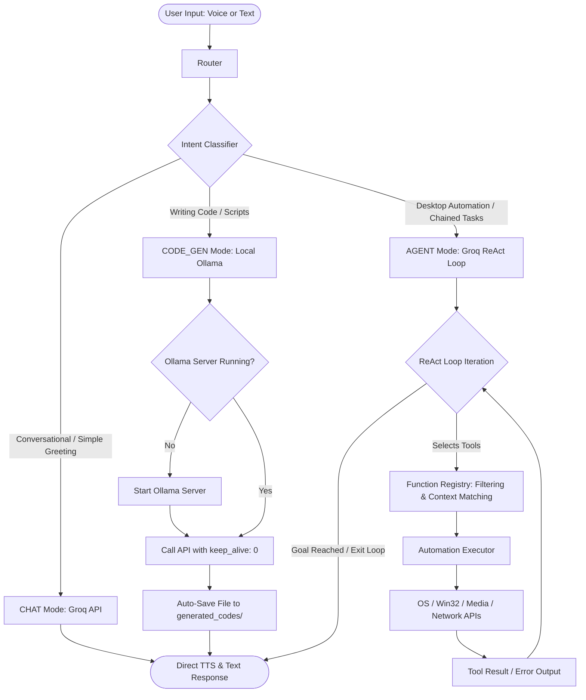

<div align="center">


# IntelliDesk AI

### *Next-Gen AI-Powered Desktop Automation & Smart Companion for Windows*

[](https://www.python.org/)
[](https://www.microsoft.com/windows)
[](LICENSE)
[](https://groq.com/)
[](https://ollama.com/)

**IntelliDesk AI** is an advanced, context-aware, multi-step autonomous desktop assistant designed for Windows. Powered by a hybrid routing brain, it converts natural language (voice or text in English & Hinglish) into rich desktop actions, private offline code generation, or natural conversation. 

[Explore Features](#-key-capabilities) • [System Architecture](#-system-architecture) • [Getting Started](#%EF%B8%8F-quick-start) • [Configuration](#-configuration) • [Interactive Hotkeys](#-interactive-hotkeys)

</div>

---

## 🚀 Key Capabilities

### 🧠 Hybrid Routing Brain
Unlike standard chatbots that incur high API token costs and latency for every query, IntelliDesk AI processes requests through a high-performance **Intent Classifier**:
* **CHAT Mode**: Fast conversational interactions utilizing Groq's `llama-3.1-8b-instant` API.
* **CODE_GEN Mode**: Offline, private code generation utilizing a local **Ollama** model (`qwen2.5-coder:3b`), featuring smart VRAM management that unloads the model immediately after execution to keep system footprint near zero.
* **AGENT Mode**: An autonomous **ReAct (Reasoning and Action)** loop using Groq to plan, execute, analyze errors, and chain multiple OS operations.

### 🗣️ Multilingual Voice Engine
* **Hinglish & English Support**: Speak naturally using a mix of Hindi and English (e.g. *"chrome kholo then background music play karo"*).
* **Rich Speech-to-Text (STT)**: Highly accurate voice detection with hotkey control.
* **Text-to-Speech (TTS)**: Clean, natural-sounding audio feedback powered by **Edge TTS** (with local `pyttsx3` fallback).

### 🛡️ Sentry Mode (Security & Surveillance)
Turn your computer into a smart room guard:
* Initiates motion detection on your webcam via **OpenCV** in a background thread.
* Tracks motion activity and generates logs.
* Automatically sends instant **Telegram notifications and snapshot alerts** to your phone when motion is detected.

### ⚙️ 60+ Autonomous Desktop Actions
Directly interact with Windows via Win32 binding, automation tools, and OS APIs:
* **System Commands**: Volume, brightness, battery info, sleep, lock, shutdown, application launching.
* **Window Manipulation**: Minimize, maximize, focus, close, and tile active application windows.
* **Reminders & Timers**: Thread-safe background scheduler that survives application restarts.
* **Integrations**: Auto-send emails (SMTP) and WhatsApp messages (pywhatkit), control media keys, simulate keystrokes, perform file/directory management (copy, move, delete to Recycle Bin), and search Wikipedia.

---

## 📐 System Architecture

The workflow below illustrates how IntelliDesk AI parses user inputs, routes them to the appropriate execution engines, and interacts with your system:


```mermaid
graph TD
    User([User Input: Voice or Text]) --> Router[Router]
    
    %% Intent Classification
    Router --> IC{Intent Classifier}
    IC -- "Conversational / Simple Greeting" --> Chat[CHAT Mode: Groq API]
    IC -- "Writing Code / Scripts" --> CodeGen[CODE_GEN Mode: Local Ollama]
    IC -- "Desktop Automation / Chained Tasks" --> Agent[AGENT Mode: Groq ReAct Loop]

    %% Mode Processing
    Chat --> Response([Direct TTS & Text Response])
    
    CodeGen --> OllamaPersistent{Ollama Server Running?}
    OllamaPersistent -- No --> StartOllama[Start Ollama Server] --> CallOllama
    OllamaPersistent -- Yes --> CallOllama[Call API with keep_alive: 0]
    CallOllama --> SaveCode[Auto-Save File to generated_codes/]
    SaveCode --> Response
    
    Agent --> ReActLoop{ReAct Loop Iteration}
    ReActLoop -- "Selects Tools" --> ToolRegistry[Function Registry: Filtering & Context Matching]
    ToolRegistry --> Exec[Automation Executor]
    Exec --> OS[OS / Win32 / Media / Network APIs]
    OS --> Feedback[Tool Result / Error Output]
    Feedback --> ReActLoop
    ReActLoop -- "Goal Reached / Exit Loop" --> Response
```

---

## 📂 Project Layout

Here is a breakdown of the code organization and key modules:

```
IntelliDesk-AI/
├── run.py                       # Main application entry point (GUI / CLI)
├── config.py                    # Centralized configurations & validation
├── requirements.txt             # Project dependencies
├── project_brief_and_architecture.md # Technical breakdown for developers
├── README.md                    # User guide and documentation
├── .env.example                 # Template for environment variables
├── data/                        # SQLite Database, application logs, and state
└── src/
    ├── automation/              # Desktop automation routines
    │   ├── email_ops.py         # SMTP email utility
    │   ├── file_ops.py          # File and directory operations
    │   ├── keyboard_ops.py      # Simulated inputs & key presses
    │   ├── media_ops.py         # Playback & volume settings
    │   ├── reminder_ops.py      # Thread-safe reminder scheduler
    │   ├── sentry_mode.py       # Sentry webcam surveillance loop
    │   ├── system_ops.py        # System commands (sleep, lock, volume)
    │   ├── utility_ops.py       # Wikipedia search, clipboard actions
    │   ├── vision_ops.py        # Screenshot and webcam utilities
    │   ├── web_ops.py           # Web search, URL opening
    │   ├── whatsapp.py          # WhatsApp automation
    │   └── window_ops.py        # Win32 Window manipulation
    ├── core/                    # System orchestrations
    │   ├── agentic_manager.py   # ReAct execution loop & LLM planning
    │   ├── automation_executor.py # Maps agent output to python functions
    │   ├── context_manager.py   # Retrieves system context (time, active apps)
    │   ├── conversation_manager.py # Manages SQLite conversation logs
    │   ├── function_registry.py # Dynamically filters available functions
    │   ├── groq_assistant.py    # Groq API assistant logic & prompt injection
    │   ├── intent_classifier.py # Fast rule-based routing engine
    │   └── router.py            # Main entry hub that selects executing mode
    ├── database/                # SQLite database management
    ├── gui/                     # Translucent Glassmorphic UI (CustomTkinter)
    │   └── spotlight_app.py     # Command palette & system drawer
    ├── llm/                     # LLM Clients (Groq, Ollama)
    └── utils/                   # Shared utilities (logging, STT, Edge-TTS)
```

---

## 🛠️ Quick Start

### 📋 Prerequisites
* **OS**: Windows 10 or 11 (64-bit)
* **Python**: Version 3.11 or newer
* **Hardware (Optional)**: Microphone for voice input, Webcam for Sentry mode, and Ollama installed for offline code gen.

### 📥 Installation & Setup
1. **Clone the Repository:**
   ```bash
   git clone https://github.com/abhaygupta56/IntelliDesk-AI.git
   cd IntelliDesk-AI
   ```

2. **Create a Virtual Environment & Install Dependencies:**
   ```bash
   python -m venv venv
   venv\Scripts\activate
   python -m pip install --upgrade pip
   python -m pip install -r requirements.txt
   ```

3. **Configure Environment Variables:**
   Duplicate the `.env.example` file, rename it to `.env`, and populate your secrets:
   ```env
   # Required
   GROQ_API_KEY=gsk_your_groq_api_key_here

   # Optional (Required for Sentry Alerts)
   TELEGRAM_BOT_TOKEN=your_bot_token
   TELEGRAM_CHAT_ID=your_chat_id

   # Optional (Required for Code Gen)
   OLLAMA_BASE_URL=http://localhost:11434
   OLLAMA_MODEL=qwen2.5-coder:3b

   # Optional (Required for Email Automation)
   EMAIL_ADDRESS=your_email@gmail.com
   EMAIL_PASSWORD=your_app_password
   ```

### ⚡ Running the App
* **Standard GUI (Spotlight Panel):**
  ```bash
  python run.py
  ```
* **CLI Mode (Terminal-Only):**
  ```bash
  python run.py --cli
  ```

---

## 🎛️ Interactive Hotkeys

When running the GUI app, the following system-wide hotkeys are active:

| Shortcut | Action | Description |
| :---: | :--- | :--- |
| <kbd>Ctrl</kbd> + <kbd>Space</kbd> | **Toggle Panel** | Shows or hides the spotlight search overlay |
| <kbd>F11</kbd> | **Toggle Voice Input** | Enables/disables voice listening (Microphone) |
| <kbd>F12</kbd> | **Toggle TTS** | Toggles voice responses on/off |
| <kbd>F10</kbd> | **Mute Speech** | Stops any ongoing speech output immediately |
| <kbd>Esc</kbd> | **Hide GUI** | Hides the palette from the view |

---

## 💬 Example Prompt Showcase

IntelliDesk AI supports structured, multi-step instructions, conversational topics, and multilingual Phrasing:

### 🇬🇧 English Commands
* **App Actions:** `"open notepad and write Hello World"`
* **System Commands:** `"set volume to 50% and mute the mic"`
* **Web Search:** `"open chrome then search for python tutorials"`
* **Utilities:** `"set a reminder in 10 minutes to take a break"`
* **Sentry Guard:** `"start sentry mode for 30 minutes"`
* **Code Writing:** `"write a python function to check if a number is prime"`

### 🇮🇳 Hinglish Commands
* **App Actions:** `"notepad kholo and likho welcome to my pc"`
* **System Commands:** `"sound 40 percent kar do"` or `"pc lock karo"`
* **Communication:** `"john ko email bhejo saying file ready hai"`
* **Reminders:** `"1 baje lunch reminder set karo"`

---

## ⚙️ Configuration Reference

The application behaviors are governed by keys defined in the `.env` file:

| Parameter | Type | Default Value | Description |
| :--- | :---: | :---: | :--- |
| `GROQ_API_KEY` | String | *Required* | API Key from Groq console |
| `LANGUAGE` | Option | `auto` | Set voice interpreter (`auto`, `en`, `hi`) |
| `VOICE_ENABLED` | Boolean | `false` | Enable spoken responses at launch |
| `VOICE_RATE` | Integer | `150` | Speaking speed (words per minute) |
| `OLLAMA_BASE_URL` | String | `http://localhost:11434` | Endpoint to local Ollama runner |
| `OLLAMA_MODEL` | String | `qwen2.5-coder:3b` | Target offline coding LLM |
| `TELEGRAM_BOT_TOKEN` | String | *Optional* | Telegram Bot API Token for alerts |
| `TELEGRAM_CHAT_ID` | String | *Optional* | Recipient ID for telegram notifications |
| `EMAIL_ADDRESS` | String | *Optional* | Sender email address for SMTP |
| `EMAIL_PASSWORD` | String | *Optional* | Gmail app password (avoid standard passwords) |

---

## 🛡️ Sentry Mode Setup Guide

To configure room surveillance with instant Telegram picture alerts:
1. Message `@BotFather` on Telegram to create a new bot and copy the **Bot Token**.
2. Start a chat with your bot, then visit `https://api.telegram.org/bot<YOUR_BOT_TOKEN>/getUpdates` to retrieve your personal **Chat ID** (the `"id"` field under `"chat"`).
3. Set `TELEGRAM_BOT_TOKEN` and `TELEGRAM_CHAT_ID` in your `.env` file.
4. Try typing: `"start sentry"` in the command palette. When the camera captures motion, it immediately takes a snapshot and sends it directly to your Telegram chat.

---

## 🧑‍💻 Contributing & Development

We welcome code improvements and features!
1. Fork the project repository.
2. Create your feature branch (`git checkout -b feature/AmazingFeature`).
3. Commit your changes (`git commit -m 'Add some AmazingFeature'`).
4. Push to the branch (`git push origin feature/AmazingFeature`).
5. Open a Pull Request.

> [!NOTE]
> Please ensure you do not commit your `.env` file or local `data/intellidesk.db` database instances. Add any new external package dependencies to `requirements.txt`.

---

## 📄 License & Credits

Distributed under the MIT License. See [LICENSE](LICENSE) for details.

* Developed by **Abhay Gupta** - [@abhaygupta56](https://github.com/abhaygupta56) - abhaygupta3347@gmail.com
