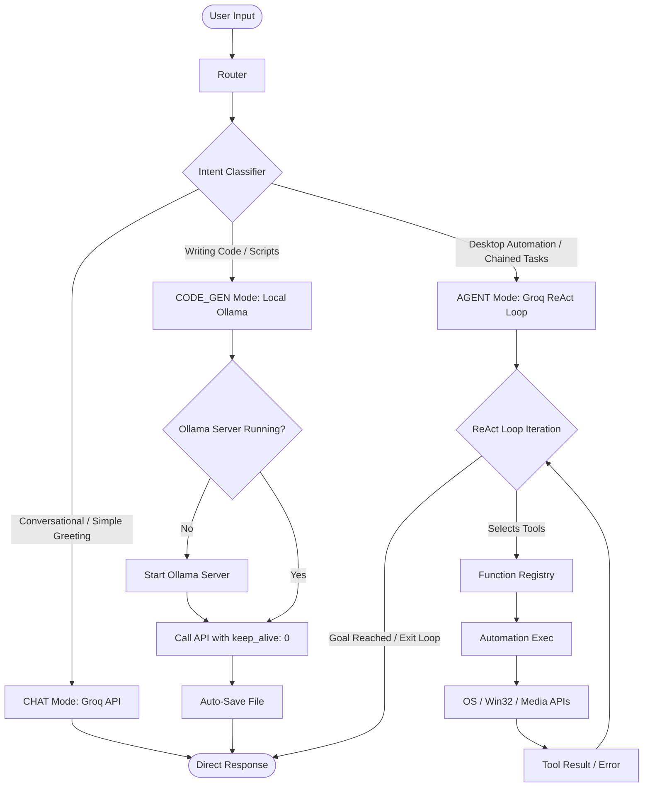

# IntelliDesk-AI: Interview Prep & Architectural Guide

This document is a comprehensive guide to understanding and explaining the architecture, codebase, and technical decisions behind **IntelliDesk-AI**. Use this to brief interviewers on how the project is structured, the design patterns applied, and how AI-driven desktop automation is executed efficiently.

---

## 1. Project Overview & Pitch
**IntelliDesk-AI** is a context-aware, multi-step, autonomous AI desktop assistant. Unlike basic chatbots or static voice command scripts (which can only run simple, pre-mapped commands), IntelliDesk-AI features a hybrid routing brain that can decide whether to converse naturally, generate code offline, or execute complex desktop tasks autonomously.

### The Problem It Solves:
1. **API Latency and Costs**: Standard LLM agents call expensive APIs even for basic greetings or local system actions.
2. **Context Blindness**: Desktop assistants usually lack awareness of system states like time, active windows, or battery levels.
3. **Rigid Tool Schemas**: Traditional assistants crash or hallucinate if the LLM passes slightly malformed parameters to local system tools.
4. **RAM and VRAM Exhaustion**: Running local coding models offline uses massive hardware resources. IntelliDesk-AI persistent-serve logic with auto-unloading keeps the RAM footprint low.

---

## 2. Core Architecture & Request Flow

The diagram below details how a user input is routed, processed, and executed:

---

## 3. File-by-File Breakdown (Kese Kya Kaam Karti)

### 📂 Entrypoint & Orchestration
*   **`run.py`**
    *   *What it does*: Launches the application. It validates the configuration (.env file), initializes system logs, starts the voice manager, and launches the CustomTkinter GUI.
    *   *Why it's needed*: Serves as the bootstrapping layer to guarantee the database, environment, and dependencies are healthy before booting.

### 📂 Core Brain (`src/core/`)
*   **`router.py`**
    *   *What it does*: The traffic controller. It receives user inputs and coordinates between `IntentClassifier`, `ConversationManager`, and `AgenticManager` to execute the appropriate pipeline.
    *   *Why it's needed*: Avoids executing the heavy ReAct loop for basic chats, saving API latency and Groq tokens.
*   **`intent_classifier.py`**
    *   *What it does*: Uses a fast rule-based matcher to classify queries. It detects greetings (routes to `CHAT`), code generation keywords (routes to `CODE_GEN`), or desktop requests (routes to `AGENT`).
    *   *Why it's needed*: High efficiency classification with zero LLM token costs or API latency.
*   **`agentic_manager.py`**
    *   *What it does*: Orchestrates the autonomous **ReAct (Reasoning and Action)** loop. It maps user goals to specific system parameters, invokes tools from the registry, evaluates results, and continues execution until the task is complete.
    *   *Why it's needed*: Enables multi-step chaining (e.g., "Open Notepad, type something, then mute volume") without requiring the user to issue separate commands.
*   **`groq_assistant.py`**
    *   *What it does*: Manages communication with the Groq API (using the ultra-fast `llama-3.1-8b-instant` model). It injects context, maintains a short conversation history, and handles XML fallback parsing.
    *   *Why it's needed*: Provides high-speed conversational capability and tool parameter generation.
*   **`function_registry.py`**
    *   *What it does*: A centralized registry of all python automation modules. It dynamically filters tools based on keywords to minimize prompt overhead sent to the LLM.
    *   *Why it's needed*: Exposing 50+ tools in every LLM call exceeds context windows and causes hallucinations. Filtering toolsets based on input intent keeps prompt sizes tiny.

### 📂 UI & Presentation (`src/gui/`)
*   **`spotlight_app.py`**
    *   *What it does*: The visual control palette featuring a modern, dark glassmorphism design. It contains a text input, submit buttons, processing progress indicators, and a custom collapsible details widget.
    *   *Why it's needed*: Provides a premium, non-obtrusive Spotlight-like desktop interface for seamless keyboard interactions.
    *   *Key Technical Feature*: The **Collapsible Details Widget** routes background logs (like mode detection, iteration states, and executed tools) inside a toggleable drawer. This keeps the main output clean for user answers while allowing power users to inspect detailed logs.

### 📂 Offline Code Gen (`src/llm/`)
*   **`ollama_client.py`**
    *   *What it does*: Communicates with local Ollama instances (`qwen2.5-coder:3b`) to write scripts.
    *   *Key Performance Optimization*: Instead of starting/killing the background subprocess on every request (which incurs a 3-5 second delay), it keeps the server running and uses `"keep_alive": 0` in the payload. This tells Ollama to **immediately unload model weights from VRAM/RAM** after generation, keeping system memory consumption near zero when idle.

### 📂 Desktop Automation (`src/automation/`)
*   **`reminder_ops.py`**
    *   *What it does*: Creates desktop reminders and timers using database persistence and threading.
    *   *Key Engineering Feature*: Thread-safe scheduling via a `self.active_reminders` map. When a reminder fires, it triggers a system notification, updates SQLite to complete the state, and removes the timer. If a reminder is deleted, the active timer is canceled to prevent thread leaks.
*   **`system_ops.py` / `window_ops.py` / `keyboard_ops.py` / `file_ops.py`**
    *   *What they do*: Perform OS-level macros (manipulating windows via `pygetwindow`, sending keystrokes/shortcuts via `pynput` / `keyboard`, power management like sleep/lock, and file management).
    *   *Why they are needed*: Translate LLM tool parameters into concrete Win32 and system actions.

---

## 4. Key Technologies Used
1.  **Groq API (`llama-3.1-8b-instant`)**: High-speed, low-latency cloud inference for the ReAct logic and chat.
2.  **Ollama (`qwen2.5-coder:3b`)**: Fully private, local LLM integration for generating code without using API quotas.
3.  **CustomTkinter & BlurWindow**: Python GUI components customized with Win32 DLL calls to render translucent, modern styling (Glassmorphism).
4.  **Thread-local SQLite**: Thread-local database connections (`threading.local()`) to allow the main GUI thread, background timers, and agent processes to write to the same database safely without locks.
5.  **Win32 API Binding (`pywin32`)**: Used for fine-grained control of the active OS windows, system audio controls, and application states.

---

## 5. Why This Implementation is Effective (For the Interview)

> [!TIP]
> **API Efficiency**: By using rule-based classifiers and routing chat messages directly, we bypass the ReAct prompt generation, cutting token costs by up to 75% for basic greetings.

> [!IMPORTANT]
> **Graceful Error Recovery**: If a tool execution fails (e.g. attempting to open an app that isn't installed), the failure feedback is fed back to the LLM in the next ReAct iteration. The model dynamically attempts an alternative route or explains the failure, preventing system freezes.

> [!NOTE]
> **Persistent Reminder Management**: Reminders survive application restarts by querying pending items on boot. If a reminder's target timestamp passed while the app was closed, it triggers a "Missed Reminder" notification upon launch.
